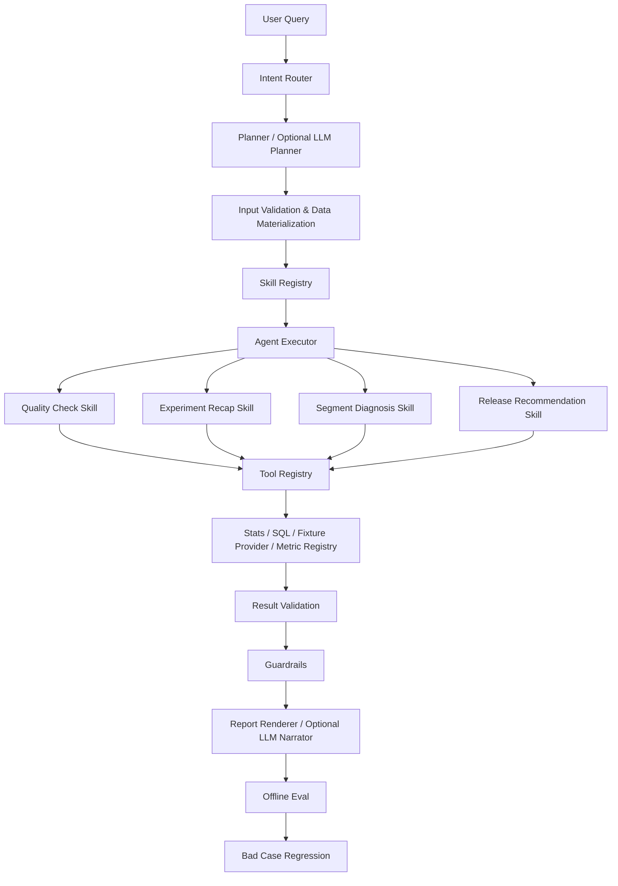

# Experiment Analysis Agent · ExperimentOS

一个面向 A/B 实验分析的可运行 Agent Workflow。它不是把统计计算交给 LLM 的聊天机器人，而是将问题理解、计划和叙述与确定性统计工具、质量约束、Eval 回归分离。

> LLMs handle intent understanding, planning and narration; deterministic tools handle statistical computation and validation.

## 1. Why

实验分析的关键风险并非“不会写结论”，而是：错误的输入口径、SRM 或样本质量问题、把相关性当作因果、以及只因 uplift 为正就建议发布。

ExperimentOS 的目标是将这些约束变成可执行工作流：先验证、再计算、后解释，并保存每一轮工具调用轨迹供 Eval 与排障复用。

## 2. Architecture



工作流状态由 `ExperimentState` 承载，记录 request、plan、缺失输入、质量问题、指标结果、分群发现、建议和 Trace。默认最多 5 次工具调用，避免无限循环。

## 3. Core Design

### Skills

`experimentos/skills/` 将分析逻辑封装为可注册组件：

- `quality_check`：SRM、样本量和时长风险；
- `experiment_recap`：总体指标统计检验；
- `segment_diagnosis`：仅产出探索性分群发现；
- `driver_analysis`：可验证的指标拆解框架；
- `release_recommendation`：综合质量、核心指标与护栏指标。

新增 Skill 无需修改 Orchestrator；只需实现统一接口并注册。

### Tools

`ToolRegistry` 管理统一 metadata 和受限调用：

- `get_experiment_report` / `query_data` / `profile_data`
- `check_quality`
- `analyze_metric` / `analyze_segment`
- `lookup_metric`
- `driver_analysis`
- `make_recommendation`

每次调用生成 `ToolTrace(tool_name, input, output, status, latency_ms)`。Trace 只保存摘要，不保存原始数据载荷。

### Statistics and result schema

`MetricResult` 统一提供：`metric_name`、`metric_kind`、`metric_role`、两组样本量、对照/实验值、绝对/相对变化、p-value、CI、显著性、`statistical_method` 与 `statistical_source`。

- 转化指标：pooled two-proportion z-test + unpooled Wald CI；
- 连续指标：Welch t-test + Welch–Satterthwaite 自由度和对应 CI；
- 平台/fixture 指标：保留平台的统计状态，并标记 `platform_reported`；
- LLM 不参与数值计算。

### Guardrails

- 高严重度 SRM 会阻断业务发布结论；
- 护栏指标显著恶化时不建议发布；
- 结果校验会检查样本量、p-value、CI 顺序与显著性一致性；
- 输出区分 Facts、Inferences、Hypotheses；
- 分群发现固定标为“待验证假设”，不作因果结论。

### Optional LLM Planner

`LLMPlanner` 要求输出受 schema 校验的 JSON：目标、缺失输入、skills、tools 与推理约束。无效 JSON、未知枚举或请求失败时会自动回退到 deterministic `Planner`。无 LLM 时完整工作流仍可运行。

## 4. Demos

所有 Demo 都是合成的、离线的确定性输入。

```bash
python -m experimentos.app.cli examples/basic_recap.json
python -m experimentos.app.cli examples/quality_srm.json
python -m experimentos.app.cli examples/segment_diagnosis.json
```

| Demo | 展示内容 | 预期重点 |
| --- | --- | --- |
| `basic_recap` | 核心指标 + 护栏指标 + 分群 | 护栏显著恶化时不建议发布 |
| `quality_srm` | SRM 检查 | 暂停业务结论解读 |
| `segment_diagnosis` | 新/老用户分群 | 仅输出探索性、待验证发现 |

SQL Demo 使用本地 DuckDB 和可聚合的一阶/二阶矩：

```bash
python -m experimentos.app.cli --init-demo-db
python -m experimentos.app.cli examples/sql_recap.json
```

`examples/libra_recap.json` 是本地 report fixture，只读取仓库内 JSON；不会访问线上 provider。实时 provider 默认关闭，必须显式设置 `allow_live_provider=true`，且不属于 CI 或 Eval 的执行范围。

## 5. Evaluation

```bash
python -m evals.runner
```

Eval Case schema 位于 `evals/cases/`，每条 Case 包含：

```json
{
  "id": "E001",
  "input": {},
  "expected": {},
  "checks": ["metric_definition", "numeric_accuracy", "completeness", "logic", "expression"]
}
```

当前 Evaluator 覆盖指标定义、数值正确性、结果完整性、统计逻辑和表达约束。运行后会生成（未纳入 Git）`evals/reports/latest.json` 与 `evals/reports/latest.md`。

## 6. Bad Case Loop

`bad_cases/` 记录失败输入、根因、修复与回归用例。当前示例覆盖：

- 分群被过度表述为因果结论；
- SRM 未阻断发布建议；
- 只输出 uplift 而遗漏统计字段。

完整闭环：`Bad Case → Root Cause → Prompt / Skill / Workflow Fix → Regression Case → Eval Score`。

## 7. Local Development

要求 Python 3.11+：

```bash
python3 -m venv .venv
. .venv/bin/activate
python -m pip install -U pip
python -m pip install -e '.[dev]'
python -m pytest -q
python -m evals.runner --no-write
```

VS Code 已提供：

- 初始化虚拟环境和依赖；
- 运行 Demo、SQL Demo 和 fixture Demo；
- `ExperimentOS: Run All Tests`；
- `ExperimentOS: Run Eval`；
- `ExperimentOS: Run Agent`；
- Eval 的调试启动配置。

GitHub Actions 在每次 push 和 pull request 运行 `pytest` 与离线 Eval smoke test；不使用任何线上或内部数据源。

## 8. Privacy and data boundary

- 仓库只包含合成 fixture，不包含 token、API key、真实业务数据、内部 URL 或个人信息；
- 本地 registry adapter 必须通过环境变量或显式路径配置，仓库没有默认内部路径；
- 线上 provider 默认禁用，Eval/CI 始终只使用 fixture；
- 工具 Trace 记录摘要而非原始查询结果。

## 9. Roadmap

- 增加更多统计方法与多重比较校正；
- 为真实、已授权数据源实现独立 adapter；
- 扩充 Eval Case 和 Bad Case 覆盖率；
- 在复杂度确实增长时再评估图工作流框架。
