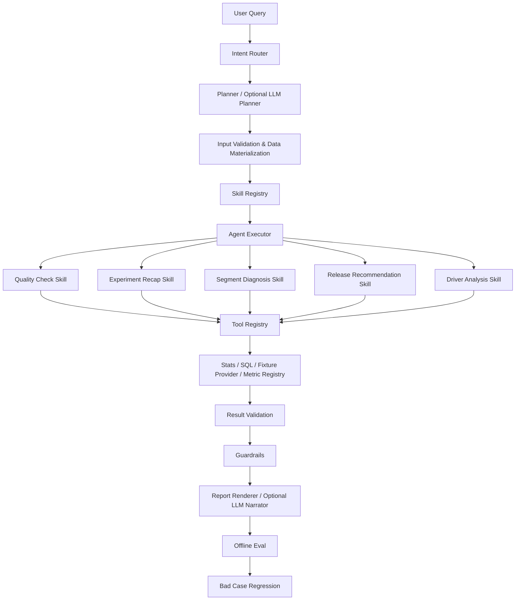

# Experiment Analysis Agent · ExperimentOS

一个面向 A/B 实验分析的可运行 Agent Workflow。

ExperimentOS 不是把统计计算交给 LLM 的聊天机器人，而是将**问题理解、任务规划与自然语言叙述**，与**确定性统计计算、实验质量检查、结果校验、发布护栏和 Eval 回归**进行分离。

> LLMs handle intent understanding, planning and narration; deterministic components handle statistical computation, validation and guardrails.

---

## 1. Why

实验分析的关键风险并不是“不会写结论”，而是：

- 输入口径错误；
- SRM 或样本质量问题；
- 指标定义与实验目标不一致；
- 把相关性或探索性分群结果误解为因果关系；
- 只因为核心指标 uplift 为正，就直接建议发布。

ExperimentOS 的目标是将这些分析约束转化为可执行工作流：

**先验证，再计算，后解释。**

同时，通过 Workflow Trace 和 Tool Trace 保存每轮执行轨迹，为 Agent 的评估、排障和迭代提供结构化依据。

---

## 2. Architecture



工作流状态由 `ExperimentState` 承载，记录：

- `request`
- `plan`
- 缺失输入
- 实验质量问题
- 指标结果
- 分群发现
- 发布建议
- `Workflow Trace`
- `Tool Trace`

Agent Executor 对工具调用设置上限，避免出现无限循环。

---

## 3. Quick Start

### 3.1 Environment

要求：

- Python 3.11+
- 本地 Python 虚拟环境

```bash
python3 -m venv .venv
. .venv/bin/activate

python -m pip install -U pip
python -m pip install -e '.[dev]'
```

### 3.2 Run tests

```bash
python -m pytest -q
```

Expected:

```text
65 passed
```

### 3.3 Run the demo

```bash
python -m experimentos.app.cli examples/product_detail_release.json --trace
```

### 3.4 Run offline Eval

```bash
python -m evals.runner
```

当前包含 4 个 Eval Case，覆盖 5 个评测维度。

---

## 4. Core Design

### 4.1 Skills

`experimentos/skills/` 将分析能力封装为可注册组件：

- `quality_check`：SRM、样本量和实验时长风险；
- `experiment_recap`：总体指标统计检验；
- `segment_diagnosis`：探索性分群诊断，结果经 Benjamini-Hochberg FDR 多重比较校正并标注校正后 p 值；
- `driver_analysis`：可验证的指标拆解框架；
- `release_recommendation`：综合质量、核心指标和护栏指标给出发布建议。

新增 Skill 无需修改 Orchestrator，只需实现统一接口并完成注册。

任务 → Skill 的路由由每个 Skill 的 `metadata.task_types` 声明，注册表据此推导任务路由（`DEFAULT_SKILLS_BY_TASK`），Planner 直接复用同一份推导结果——路由只有单一事实来源。

### 4.2 Tools

`ToolRegistry` 管理统一的工具 metadata 与受限调用。

当前主要工具包括：

- `get_experiment_report`
- `query_data`
- `profile_data`
- `check_quality`
- `analyze_metric`
- `analyze_segment`
- `lookup_metric`
- `driver_analysis`
- `make_recommendation`

每次工具调用生成：

```python
ToolTrace(
    tool_name,
    input,
    output,
    status,
    latency_ms
)
```

Trace 只保存摘要信息，不保存原始数据载荷。

任务 → 工具的路线由所选 Skill 的 `metadata.required_tools` 推导（`DEFAULT_TOOLS_BY_TASK`），与 Skill 路由天然一致。

### 4.3 Statistics and Result Schema

`MetricResult` 为不同数据来源提供统一、可审计的统计结果结构，包含：

- `metric_name`
- `metric_kind`
- `metric_role`
- `direction`
- `control / treatment sample size`
- `control / treatment value`
- `absolute change`
- `relative change`
- `p-value`
- `confidence interval`
- `significance`
- `statistical_method`
- `statistical_source`
- `interpretation`

统计计算由确定性组件完成，LLM 不参与数值计算。

#### Conversion Metrics

采用：

- Pooled two-proportion z-test
- Unpooled Wald confidence interval

#### Continuous Metrics

采用：

- Welch t-test
- Welch–Satterthwaite degrees of freedom
- 对应 confidence interval

#### Platform / Fixture Metrics

保留平台侧统计结果，并通过 `statistical_source` 区分：

- `computed`
- `platform_reported`

#### Multiple Comparison Correction

分群诊断在展示前对全部受检分群的 p 值做 Benjamini-Hochberg FDR 校正：

- 校正覆盖过滤与排序之前的**全部分群**，避免先过滤虚增显著性；
- 证据文本以校正后状态为准，并同时输出原始 p 与校正 p，便于审计；
- 原始显著但校正后不显著的结果降级为「探索性线索」，不作为显著发现。

分析阈值（SRM α、最小样本量、最短实验天数、分群最小 n、分群发现上限）均由 `ExperimentContext` 参数化，可按业务场景调整。

### 4.4 Guardrails

ExperimentOS 在分析过程中加入显式实验约束：

- 高严重度 SRM 风险会阻断或降低业务结论强度；
- 护栏指标显著恶化时不建议发布；
- 结果校验会检查样本量、p-value、CI 顺序和显著性之间的一致性；
- 输出区分 Facts、Inferences 和 Hypotheses；
- 分群结果固定标记为“待验证假设”，不得直接作为因果结论。

核心原则：

> A positive uplift on the core metric does not automatically imply that the experiment should be released.

### 4.5 LLM Planner

`LLMPlanner` 是可选的。

LLM Planner 要求输出结构化 JSON：

```json
{
  "goal": "...",
  "required_inputs": [],
  "skills": [],
  "tools": [],
  "reasoning_constraints": []
}
```

输出经过 Schema Validation：

```text
LLM
 ↓
JSON Parsing
 ↓
Schema Validation
 ↓
Validated Plan
```

当发生以下情况时：

- JSON 无法解析；
- 必填字段缺失；
- 字段类型错误；
- 未知 Skill；
- 未知 Tool；
- LLM 调用失败；

系统会自动回退到 deterministic Planner。

同时，LLM 不能删除强制的质量检查、统计分析和发布护栏。

因此：

```text
LLM Planner
    ↓
Schema Validation
    ↓
LLM Plan
    +
Deterministic Constraints
    ↓
Final Execution Plan
```

LLM 可以扩展规划，但不能绕过实验分析的安全边界。

### 4.6 LLM Narrator

`LLMNarrator` 负责将已经完成的结构化实验结果转换为自然语言报告。

其输入来自：

- 实验质量结果；
- 指标统计结果；
- 分群发现；
- Facts；
- Inferences；
- Hypotheses；
- Recommendations。

统计事实始终来自确定性计算结果，不由 LLM 重新计算。

当 LLM 不可用时，自动回退到模板化 `ReportRenderer`。

---

## 5. Demo

### 5.1 Scenario

商品详情页改版 A/B 实验：

> “新版商品详情页是否支持上线？进一步诊断新用户和老用户的表现差异。”

实验目标：

提升商品详情页转化率，同时不损害每用户收入。

### 5.2 Run

```bash
python -m experimentos.app.cli examples/product_detail_release.json --trace
```

### 5.3 Agent Execution Trace

典型执行链路：

```text
User Query
    ↓
Intent Router
    ↓
Planner
    ↓
Input Validation
    ↓
Skills
    ├── quality_check
    ├── experiment_recap
    ├── segment_diagnosis
    └── release_recommendation
    ↓
Deterministic Tools
    ├── check_quality
    ├── analyze_metric
    ├── analyze_segment
    └── make_recommendation
    ↓
Result Validation
    ↓
Guardrails
    ↓
Final Report
```

CLI 可以输出：

```text
========== Agent Execution Trace ==========

Workflow:
[1] planner
[2] input_validation
[3] skill:quality_check
[4] skill:experiment_recap
[5] skill:segment_diagnosis
[6] skill:release_recommendation
[7] result_validation
[8] guardrails
[9] report_generation

Tool Calls:
[1] check_quality
[2] analyze_metric
[3] analyze_segment
[4] make_recommendation

============================================
```

### 5.4 Key Results

| Metric       | Control | Treatment | Relative Change | Result                |
| ------------ | ------- | --------- | --------------- | --------------------- |
| CVR          | 10.00%  | 11.56%    | +15.58%         | Significant uplift    |
| GMV per user | 12.40   | 12.10     | -2.42%          | Significant degradation |

### 5.5 Release Decision

不建议发布。

核心指标 CVR 显著提升，但护栏指标 GMV per user 同时出现显著下降，因此当前证据不足以支持直接上线。

Agent 输出：

```text
状态：DONE_WITH_CONCERNS

建议：
- 不建议发布：至少一个护栏指标出现显著恶化。
- 补充分群复核：在总体结论之外，对重点人群做二次验证。
```

### 5.6 Segment Diagnosis

- 新用户：CVR 显著提升
- 老用户：当前未形成足够显著证据

两项结果均被标记为：

**待验证假设**

系统不会将单次分群显著性直接解释为因果关系，也不会仅基于该结果给出定向推广结论。

### 5.7 Mock LLM Planner

Offline Demo 支持 Mock LLM：

```bash
python -m experimentos.app.cli \
    examples/product_detail_release.json \
    --llm mock \
    --trace
```

Mock Planner 可以返回结构化 JSON Plan：

```json
{
  "goal": "判断商品详情页改版是否支持上线",
  "required_inputs": [],
  "skills": [
    "experiment_recap",
    "release_recommendation"
  ],
  "tools": [
    "analyze_metric",
    "make_recommendation"
  ],
  "reasoning_constraints": [
    "先检查实验质量",
    "不得将分群结果直接解释为因果"
  ]
}
```

经过 Schema Validation 后：

```text
source = llm_validated
```

如果 Mock / LLM 返回非法 JSON，则自动回退到 deterministic Planner。

---

## 6. Evaluation

运行：

```bash
python -m evals.runner
```

当前验证结果：

```text
# ExperimentOS Eval Report
- Total Cases: 4
- Passed Cases: 4
- Overall Score: 100%
```

评测覆盖 5 个维度：

- `metric_definition`
- `numeric_accuracy`
- `completeness`
- `logic`
- `expression`

当前 Case：

| Case | Scenario         | Focus                             |
| ---- | ---------------- | --------------------------------- |
| E001 | 实验复盘 + 护栏指标 | 发布建议与统计结果                |
| E002 | SRM              | 实验质量约束                      |
| E003 | 分群诊断          | 探索性结果与表达约束              |
| E004 | 商品详情页改版实验 | 电商场景下的核心指标与护栏决策    |

Eval Case 位于：

```text
evals/cases/
```

示例：

```json
{
  "id": "E001",
  "input": {},
  "expected": {},
  "checks": [
    "metric_definition",
    "numeric_accuracy",
    "completeness",
    "logic",
    "expression"
  ]
}
```

运行 Eval 后会生成：

```text
evals/reports/latest.json
evals/reports/latest.md
```

这些运行产物不纳入 Git。

---

## 7. Bad Case Loop

`bad_cases/` 用于记录 Agent 的历史失败、根因、修复方案和回归用例。

当前覆盖：

- 分群结果被过度表述为因果结论；
- SRM 风险未阻断发布建议；
- 输出 uplift 时遗漏必要统计字段；
- 电商场景下的分群过度解读。

标准闭环：

```text
Bad Case
   ↓
Root Cause
   ↓
Prompt / Skill / Workflow Fix
   ↓
Regression Case
   ↓
Eval Score
```

Example: BC004

```text
BC004
    ↓
新用户 CVR 显著提升
    ↓
错误地解释为“策略对新用户有效”
    ↓
定位为分群表达缺少约束
    ↓
增加 Hypothesis Guardrail
    ↓
E004 Regression
```

Bad Case schema 位于：

```text
bad_cases/schema.json
```

---

## 8. Observability

ExperimentOS 同时记录两个层面的执行信息。

### 8.1 Workflow Trace

记录 Agent 工作流阶段：

- `planner`
- `input_validation`
- `skill execution`
- `result_validation`
- `guardrails`
- `report_generation`

### 8.2 Tool Trace

记录工具调用：

- `tool_name`
- `input summary`
- `output summary`
- `status`
- `latency_ms`

示例：

```text
Tool Calls:
[1] check_quality
    status=OK
    latency=0.0ms

[2] analyze_metric
    status=OK
    latency=0.3ms

[3] analyze_segment
    status=OK
    latency=0.1ms

[4] make_recommendation
    status=OK
    latency=0.0ms
```

Trace 不保存原始数据载荷，主要用于：

- Agent 调试；
- 工具调用排障；
- 执行路径分析；
- Eval 问题定位；
- 后续 Agent 迭代。

---

## 9. Local Development

### Run tests

```bash
python -m pytest -q
```

### Run Eval

```bash
python -m evals.runner
```

### Run Eval without writing reports

```bash
python -m evals.runner --no-write
```

### Run basic demo

```bash
python -m experimentos.app.cli examples/basic_recap.json
```

### Run ecommerce demo

```bash
python -m experimentos.app.cli examples/product_detail_release.json --trace
```

### Run mock LLM demo

```bash
python -m experimentos.app.cli \
    examples/product_detail_release.json \
    --llm mock \
    --trace
```

### Run SQL demo

```bash
python -m experimentos.app.cli --init-demo-db
python -m experimentos.app.cli examples/sql_recap.json
```

### Auto-sync to GitHub

仓库配置了 `post-commit` 钩子：每次本地 commit 后自动把 `main` 推送到 GitHub（后台执行，失败只写日志不阻塞提交）。日志位于 `~/.experimentos-auto-sync.log`。

> 钩子存在于 `.git/hooks/`，不属于版本管理。重新 clone 后如需恢复自动同步，重新创建该钩子即可。

---

## 10. VS Code

项目提供 VS Code 相关配置，用于：

- 初始化虚拟环境和依赖；
- 运行 Demo；
- 运行 SQL Demo；
- 运行 fixture Demo；
- `ExperimentOS: Run All Tests`；
- `ExperimentOS: Run Eval`；
- `ExperimentOS: Run Agent`；
- 调试 Eval。

---

## 11. CI

GitHub Actions 在 push 和 pull request 时运行：

- `pytest`
- offline Eval smoke test

CI 不访问任何线上或内部业务数据源。

---

## 12. Privacy and Data Boundary

仓库只包含合成 fixture 和本地 Demo，不包含：

- token；
- API key；
- 真实业务数据；
- 内部 URL；
- 个人信息。

数据边界设计：

- 本地 Registry Adapter 通过环境变量或显式路径配置；
- 仓库不存在默认内部路径；
- 线上 provider 默认关闭；
- Eval 和 CI 始终使用离线 fixture；
- Tool Trace 只记录摘要，不保存原始查询结果。

实时 provider 只有在显式配置：

```text
allow_live_provider=true
```

时才允许启用，且不属于 CI 或 Eval 的执行范围。

---

## 13. Project Structure

```text
experiment-analysis-agent-lab/
│
├── bad_cases/
│   ├── examples/
│   ├── README.md
│   └── schema.json
│
├── evals/
│   ├── cases/
│   ├── reports/
│   └── runner.py
│
├── examples/
│   ├── basic_recap.json
│   ├── product_detail_release.json
│   ├── quality_srm.json
│   ├── segment_diagnosis.json
│   ├── sql_recap.json
│   └── ...
│
├── experimentos/
│   ├── agent/
│   │   ├── executor.py
│   │   ├── guardrails.py
│   │   ├── intent_router.py
│   │   ├── llm_client.py
│   │   ├── narrator.py
│   │   ├── orchestrator.py
│   │   └── planner.py
│   │
│   ├── analysis/
│   │   ├── decomposition.py
│   │   ├── quality_checks.py
│   │   ├── result_validation.py
│   │   └── segmentation.py
│   │
│   ├── skills/
│   │   └── registry.py
│   │
│   ├── tools/
│   │   ├── metric_registry.py
│   │   ├── metric_builder.py
│   │   ├── sql_runner.py
│   │   ├── stats_engine.py
│   │   └── registry.py
│   │
│   └── app/
│       ├── cli.py
│       └── registry_cli.py
│
├── metric_specs/
├── tests/
├── pyproject.toml
└── README.md
```

---

## 14. Design Principles

### 14.1 LLM interprets, deterministic code computes

LLM 负责：

- Intent Understanding
- Planning
- Narration

确定性组件负责：

- Statistical Computation
- Result Validation
- Quality Checks
- Release Guardrails

### 14.2 Flexibility must not bypass constraints

LLM Planner 可以扩展分析计划，但不能删除：

- Quality Check
- Statistical Validation
- Guardrails

### 14.3 Exploratory findings are not causal conclusions

分群结果属于探索性分析。

除非有额外验证，否则：

```text
Significant Segment Uplift
≠
Causal Effect
```

### 14.4 Eval is part of the Agent

Agent 的效果不是只看“输出是不是像人写的”。

还需要评估：

- Metric Definition
- Numeric Accuracy
- Completeness
- Statistical Logic
- Expression

并通过 Bad Case Regression 持续迭代。

---

## 15. Current Status

当前本地验证结果：

- Tests: 65 passed
- Eval: 4 / 4 cases passed
- Overall Eval Score: 100%

当前已验证的核心能力：

- ✅ Intent Router
- ✅ Deterministic Planner
- ✅ LLM Planner + Schema Validation
- ✅ Deterministic Fallback
- ✅ Skill Registry
- ✅ Tool Registry
- ✅ Statistical Engine
- ✅ Result Validation
- ✅ Guardrails
- ✅ Segment Diagnosis
- ✅ Release Recommendation
- ✅ Workflow Trace
- ✅ Tool Trace
- ✅ Offline Eval
- ✅ Bad Case Regression
- ✅ Synthetic / Offline Fixtures
- ✅ Mock LLM Planner
- ✅ BH-FDR 多重比较校正
- ✅ 分析阈值参数化（ExperimentContext）
- ✅ 任务路由单一事实来源（metadata.task_types）
- ✅ 确定性组件单测覆盖（路由/校验/护栏/工具注册表）

---

## 16. Roadmap

后续可继续演进：

- 增加更多统计方法；
- ~~引入多重比较校正~~（已完成：BH-FDR，见 4.3）；
- 扩充 Eval Case 与 Bad Case 覆盖率；
- 为真实、已授权数据源实现独立 Adapter；
- 增强 Agent Trace 与执行分析；
- 在工作流复杂度实际增长后，再评估图工作流框架。

---

## License

Internal / personal project for learning and experimentation.
